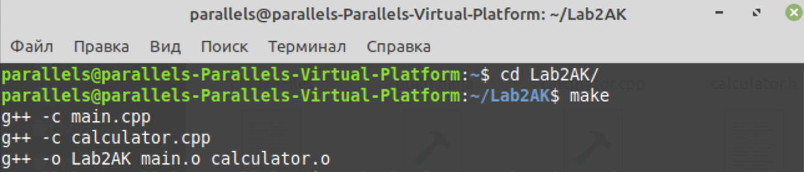
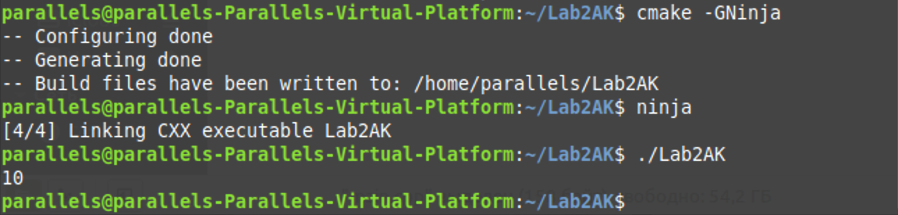

# Lab2AK

## Результати виконання збірок:  




## Лістинг:

### calculator.cpp

```cpp
#include "calculator.h"

int Calculator::Add (double a, double b)
{
	return a + b + 0.5;
}

int Calculator::Sub (double a, double b)
{
    return Add (a, -b);
}
```
### calculator.h

```cpp
#ifndef CALCULATOR_H
#define CALCULATOR_H

class Calculator
{
    public:
        int Add (double, double);
        int Sub (double, double);

};

#endif//CALCULATOR_H

```

### main.cpp

```cpp
#include "calculator.h"
#include "iostream"
using namespace std;
int main ()
{
	Calculator calculator;
	cout << calculator.Sub(20, 10) << endl;
	return 0;
}

```

### Makefile

```makefile
Lab2AK: main.o calculator.o
	g++ -o Lab2AK main.o calculator.o
main.o: main.cpp 
	g++ -c main.cpp
calculator.o: calculator.cpp
	g++ -c calculator.cpp

clean: 
	rm Lab2AK
	rm main.o
	rm calculator.o
```
### CMakeLists.txt

```cmake
cmake_minimum_required(VERSION 3.10.2)

project("Lab2AK" VERSION 0.1.0)
 
add_library(calculator STATIC calculator.cpp)
add_executable("${PROJECT_NAME}" main.cpp)
target_link_libraries("${PROJECT_NAME}" calculator)
```


